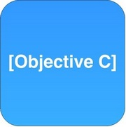

# Objective-C для iOS-разработчиков. Обучение в записи

## Содержание программы
 

  

### Урок 1. Лекция: Основы синтаксиса языка Objective-C
- Показать основы языка Objective – c. Разобрать все типы данных, также поговорить об указателях и ссылках. Показать разницу со Swift.
### Урок 2. Семинар: Погружение в Objective-C
- Создать программу калькулятор со всеми арифметическими операциями
- Создать программу, которая будет решать квадратное уравнение
- Создать программу, которая будет находить логарифм числа по основание к N.

### Домашнее задание 1 [hw-1](hw-1/README.md)
 

### Урок 3. Лекция: Объекты. Наследование, инкапсуляция и полиморфизм в Objective-C
- Показать, что такое ООП и для чего нужно.
- Поговорить о базовых принципах наследования, полиморфизма, абстракции, инкапсуляции
- Поговорить POP
### Урок 4. Семинар: Объекты. Наследование, инкапсуляция и полиморфизм в Objective-C
- Создать базовый или абстрактный класс Shape с 3 наследниками (Circle, Triangle, rectangle)
- Добавить в каждый класс необходимые поля, чтобы фигура могла существовать в декартовом пространстве
- Добавить в базовый класс метод getArea и метод getPerimenter, который будет реализован во всех наследниках и возвращать площадь фигуры и периметр, соответственно.

### Домашнее задание 2 [hw-2](hw-2/README.md)
 

### Урок 5. Лекция: Работа с памятью в Objective-C, ARC и MRC
- Показать, что такое ARC и как раньше работали с памятью (MRC).
- Рассказать о разницу между Stack vs Heap vs Global/Static scope/, разница между Swift
### Урок 6. Семинар: Работа с памятью в Objective-C, ARC и MRC
- Создать экземпляр класса, создать переменную примитивного типа и статическую перемену и убедиться, что они находятся в Heap/Stack/Static memory соответственно
- Создать цикл сильных ссылок с помощью двух классов
- Создать цикл сильных ссылок с помощью замыкания
- Решить проблему цикла сильных ссылок с помощью __weak
- Убедиться с помощью Memory Graph, что цикл сильных решён.

### Домашнее задание 3 [hw-3](hw-3/README.md)
 

### Урок 7. Лекция: Блоки и многопоточное программирование в Objective-C
- Показать, что такое Thread, GCD, Operation, как поток связан с очередью и что это такое.
- Как операционная система распределяет задачи и потоки.
### Урок 8. Семинар: Блоки и многопоточное программирование в Objective-C
- Создать и запустить PThread поток с любой задачей внутри
- Создать Thread поток с любой задачей и убедиться, что он выполняется не на главном потоке
- Создать с помощью GCD последовательную и параллельную очередь, в которую передать DispathWorkItem
- Отменить DispathWorkItem спустя 5 секунд
- Создать несколько Operations и добавить их в последовательную цепочку зависимостей и запустить на NSOperationQueue.

### Домашнее задание 4 [hw-4](hw-4/README.md)
 

### Урок 9. Лекция: Работа с сетью в Objective-C
- NSURLSession, показать как настраивает сессия и что это под капотом и как делать базовые запросы в сеть get/post
### Урок 10. Семинар: Работа с сетью в Objective-C
- Создать запрос с помощью NSURLSession к API
- Декодировать данные и вывести их в таблицу.

### Домашнее задание 5 [hw-5](hw-5/README.md)
 

### Урок 11. Лекция: Работа с файлами. Обработка ошибок. Objective-C Runtime. Жизненный цикл UIViewController
- Показать всю силу obj-c, а именно swizzling, что это и зачем используют
### Урок 12. Семинар: Работа с файлами. Обработка ошибок. Objective-C Runtime. Жизненный цикл UIViewController
- Необходимо отображать свойства объекта и его значения при его передаче в NSLog
- Создать переменную в категории с помощью objc_setAssociatedObject.

### Домашнее задание 6 [hw-6](hw-6/README.md)
 

  
#### Все задания и домашние работы выполнять в одном репозитории на GitHub
#### Домашние работы сдавать ссылкой на файл в репозитории

  
