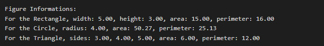

# Objective-C для iOS-разработчиков. Обучение в записи
## Урок 4. Семинар: Объекты. Наследование, инкапсуляция и полиморфизм в Objective-C
  

1. Создать абстрактный класс Figure с методами вычисления площади и периметра, а также методом, выводящим информацию о фигуре на экран.   

2. Создать производные классы: Rectangle (прямоугольник), Circle (круг), Triangle (треугольник) со своими методами вычисления площади и периметра.   

3. Создать массив n-фигур и вывести полную информацию о фигурах на экран.

  

#### Формулы для вычисления площади и периметра для геометрических фигур (и площади длины для окружности)

### Прямоугольник (Rectangle)

Площадь (area) = ширина (width) x высота (height)  
Периметр (perimeter) = 2 x (width + height)  

### Круг (Circle)

Площадь (area) = π x радиус (radius) ** 2  
Длина окружности (Circumference) = 2 x π x radius  

### Треугольник (Triangle)

Площадь (area) по формуле Герона:  
Площадь (area) = √ ( p * ( p - a )* ( p - b ) * ( p - c )),   
где. p - полупериметр треугольника (a+b+c) / 2;   
a, b, c - длины сторон треугольника.  

Периметр (Perimeter) = сторона (side) A + сторона (side) B + сторона (side) C  

 

### Вывод в консоли:

   
