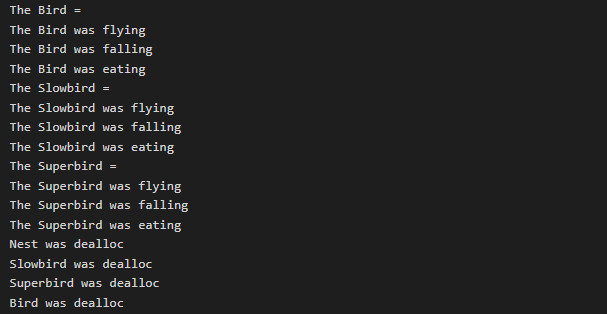

# Objective-C для iOS-разработчиков. Обучение в записи
## Урок 6. Семинар: Работа с памятью в Objective-C, ARC и MRC
  

1. Переписать всю программу, которую проходили на семинаре на ARC.  

2. Смоделировать и разработать программу «Стая птиц». 
   В данной программе должны быть классы Bird, SuperBird наследник Bird, SlowBird наследник Bird, также есть класс Nest. 
   У класса Nest есть поля bird(weak), area, occupancy. 
   У Bird есть 2 метода fly, fall, eat. 
   Реализовать все эти методы в наследниках с применением ручного управления памятью.  
   Воссоздать retain cycle и решить его. 
   (*Можете добавлять свои поля, чтобы лучше изучить работу MRC / ARC)   

    - **Улучшить созданную программу из задания 1: применить пул автоматического освобождения (ARC).**   

3. Воссоздайте ситуацию, в которой происходит цикл сохранения (retain cycle).  

4. Убедитесь, что объекты не освобождены. Для этого реализуйте метод dealloc.  

5. Обеспечьте реализацию геттера и сеттера для свойств в MRC: 
   @property (nonatomic, retain) id object1; 
   @property (nonatomic) id object2; 
   @property (nonatomic,copy) NSMutableArray *array; 
   @property (atomic,retain) NSNumber *number; 
   @property NSUInteger баланс;

  
   
### Решение задачи

 

1.1. Создается объект класса Bird и вызываются его методы fly, fall, eat.  
1.2. Создается объект класса SlowBird и вызываются его методы fly, fall, eat.  
1.3. Создается объект класса SuperBird и вызываются его методы fly, fall, eat.  

2.1. Методы fly, fall, eat каждого класса выводятся соответствующие строки в консоль.  

3.1. Объекты SuperBird, SlowBird, Nest, и Bird освобождаются в порядке их создания, в каждом случае вызывается метод dealloc.  

 

#### Результат вывода в консоли программы:     

  

