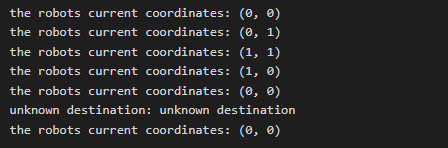

# Objective-C для iOS-разработчиков. Обучение в записи
## Урок 8. Семинар: Блоки и многопоточное программирование в Objective-C
<br><br>

1.1. В рамках программы из пункта 1, добавьте асинхронное скачивание (sleep) и отобразите все картинки сразу.<br>
1.2. Добавить отмену загрузки, если ячейка скрыта.<br><br>

2.1. Добавить Асинхронную операцию.

### Домашнее задание

Реализовать класс Robot. <br>
В классе должны быть свойства координаты x,y <br>
(по умолчанию координаты в начале имеют значения x=0, y=0) и метод run. <br>
Метод принимает блок, в зависимости от сообщения в блоке (up,down,left,right), <br>
робот движется в соответстующем направлении, то есть изменяется его текущая координата. <br>
Сообщения в блоках возвращаются только в виде строк (up,down,left,right). <br>
Показать демонстрацию движения робота по прямоугольной системе координат. <br> <br>

### Решение задачи

1. Инициализация робота. Робот инициализируется с координатами (0, 0).
2. Отображение начальной позиции:
```
Robot *robot = [[Robot alloc] init];
[robot displayPosition];
```
3. Движение робота вверх:
```
[robot run:^NSString *{
    return @"up";
}];
[robot displayPosition];

```

4. Движение робота вправо:
```
[robot run:^NSString *{
    return @"right";
}];
[robot displayPosition];

```

5. Движение робота вниз:
```
[robot run:^NSString *{
    return @"down";
}];
[robot displayPosition];

```

6. Движение робота влево:
```
[robot run:^NSString *{
    return @"left";
}];
[robot displayPosition];

```
7. Попытка движения робота в неизвестном направлении:
```
[robot run:^NSString *{
    return @"unknown destination";
}];
[robot displayPosition];

```
8. Отображение текущей (исходной) позиции:
```
[robot displayPosition];
```

<br><br>

#### Результат вывода программы в консоли:

<br><br>



<br><br>

