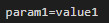
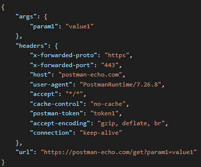
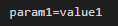
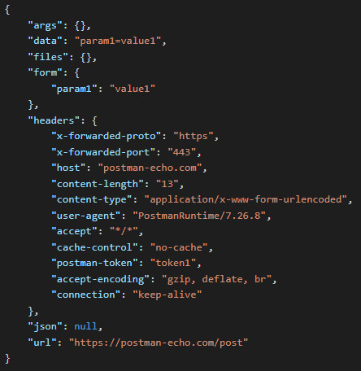
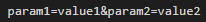
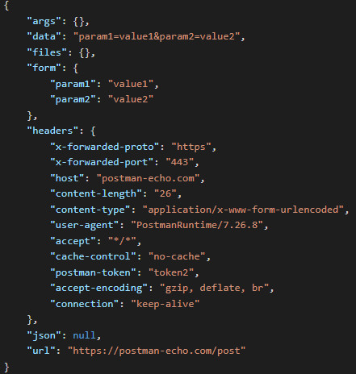
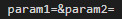
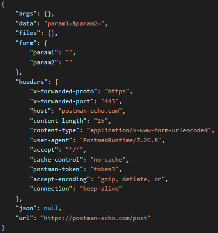
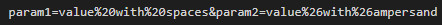
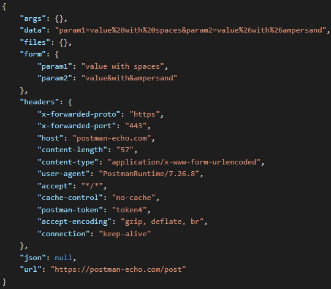

# Objective-C для iOS-разработчиков. Обучение в записи
## Урок 10. Семинар: Работа с сетью в Objective-C
  

1. Закончить задание 2, если оно не было закончено на семинаре.   

2. Реализовать мобильное приложение на языке Objective – C, которое отправляет в сеть get запрос для получения картинок и текста на любой доступный сервис, все полученные данные заполнить в UITableView аналогично заданию на семинаре.   

3. Кастомизация и дизайн таблицы индивидуальный без ограничений.

  

### Решение задания

  

#### Работа мобильного приложения

Данное мобильное приложение позволяет отправлять GET и POST-запросы и  
получать результаты в таблице на втором и третьем экранах.  
В текстовое поле на первом экране ввести параметры GET-запроса и параметры  
POST-запроса в соответствующих полях.
Нажать кнопку "GET" для отправки GET-запрос на сервер сервиса https://postman-echo.com/get или  
нажать кнопку "POST" для отправки POST-запрос на сервер сервиса https://postman-echo.com/post.  
Нажать кнопку "FORWARD" и перейти на второй экран или при POST-запросе сразу перейти на третий экран.  
На втором и третьем экранах отображаются данные, полученные с сервера, в таблице.  
Можно нажать кнопку "RESET" для очистки данных  
или кнопку "BACK TO" для возврата на первый экран (начальное окно).  

#### Содержание проекта

**FirstViewController** содержит методы:  
1. viewDidLoad - настраивает интерфейс (setupUI) при загрузке первого экрана.
2. setupUI - создает и настраивает текстовое поле (queryTextField), кнопку "GET" (getButton), кнопку "FORWARD" (forwardButton).    
3. getButtonTapped: Вызывается при нажатии на кнопку "GET". Отправляет GET-запрос с параметрами из текстового поля с помощью класса Loader.  
4. forwardButtonTapped: Вызывается при нажатии на кнопку "FORWARD". Переходит на второй экран (SecondViewController) и передает данные, полученные с сервера.  
5. postButtonTapped - при нажатии на кнопку "POST" отправляет POST-запрос на сервер с параметрами из текстового поля postQueryTextField  
   и переводит на третью страницу (ThirdViewController) и передает данные, полученные с сервера.  

**SecondViewController** содержит методы:  
1. viewDidLoad - настраивает интерфейс (setupUI) при загрузке второго экрана.  
2. setupUI - создает и настраивает кнопку "RESET" (resetButton), кнопку "BACK TO" (backButton), таблицу (tableView). Устанавливает ограничения для элементов интерфейса.  
3. resetTapped - при нажатии на кнопку "RESET", очищает данные в таблице.  
4. backTapped - при нажатии на кнопку "BACK TO", возвращает на первый экран.  
5. tableView numberOfRowsInSection - возвращает количество строк в таблице, равное количеству элементов в массиве data.  
6. tableView cellForRowAtIndexPath - настраивает ячейки таблицы.  

**ThirdViewController** содержит методы:  
1. viewDidLoad - настраивает интерфейс (setupUI) при загрузке третьего экрана.
2. setupUI - создает и настраивает кнопки "RESET", "BACK TO", таблицу (tableView).  
3. resetTapped - при нажатии на кнопку "RESET", очищает данные в таблице.  
4. backTapped - при нажатии на кнопку "BACK TO", возвращает на первый экран.  
5. tableView numberOfRowsInSection - возвращает количество строк в таблице, равное количеству элементов в массиве data.  
6. tableView cellForRowAtIndexPath - настраивает ячейки таблицы.  
    **Loader** - отправляет GET-запрос на сервер с параметрами из строки запроса (fetchDataWithQuery completion) и  
отправляет POST-запрос на сервер с параметрами из строки запроса.  
    **AppDelegate и SceneDelegate** - настраивают начальное окно приложения и  
устанавливают FirstViewController в качестве корневого контроллера.  

#### Примеры параметров GET-запроса и ответы

1.1. Параметры get-запроса:  
  
1.2. Ответ, полученный на get-запрос:  
  
  
1.1. Параметры get-запроса:  
  
1.2. Ответ, полученный на get-запрос:  
  
  
1.1. Параметры get-запроса:  
  
1.2. Ответ, полученный на get-запрос:  
  
  
1.1. Параметры get-запроса:  
  
1.2. Ответ, полученный на get-запрос:  
  

#### Примеры параметров POST-запроса и ответы

2.1. Параметры post-запроса:  
  
2.2. Ответ, полученный на post-запрос:  
  
  
2.1. Параметры post-запроса:  
  
2.2. Ответ, полученный на post-запрос:  
  
  
2.1. Параметры post-запроса:  
  
2.2. Ответ, полученный на post-запрос:  
  
  
2.1. Параметры post-запроса:  
  
2.2. Ответ, полученный на post-запрос:  
  
      
